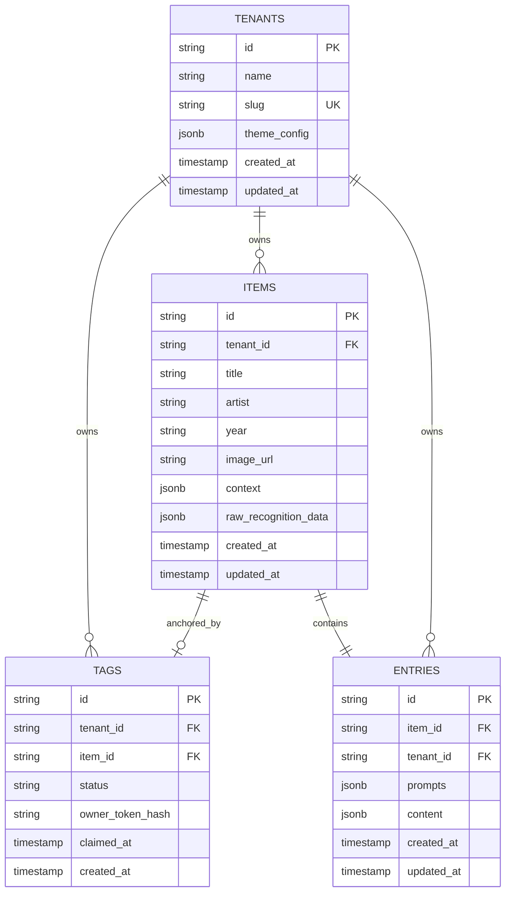

# Data Model and Schema Specifications

> Unified specification covering database tables, TypeScript classes, and API layer contracts for tenants, tags, items, and entries.

---

## Entity Relationship Overview



---

## Database Schema (PostgreSQL DDL)

```sql
-- Creating extension for UUID generation if needed
CREATE EXTENSION IF NOT EXISTS "pgcrypto";

-- Tenants table
CREATE TABLE tenants (
    id VARCHAR(36) PRIMARY KEY,
    name VARCHAR(255) NOT NULL,
    slug VARCHAR(100) UNIQUE NOT NULL,
    theme_config JSONB DEFAULT '{}'::jsonb,
    created_at TIMESTAMPTZ NOT NULL DEFAULT NOW(),
    updated_at TIMESTAMPTZ NOT NULL DEFAULT NOW()
);

-- Items table
CREATE TABLE items (
    id VARCHAR(36) PRIMARY KEY,
    tenant_id VARCHAR(36) NOT NULL REFERENCES tenants(id) ON DELETE CASCADE,
    title VARCHAR(255) NOT NULL,
    artist VARCHAR(255),
    year VARCHAR(50),
    image_url TEXT NOT NULL,
    context JSONB DEFAULT '{}'::jsonb,
    raw_recognition_data JSONB DEFAULT '{}'::jsonb,
    created_at TIMESTAMPTZ NOT NULL DEFAULT NOW(),
    updated_at TIMESTAMPTZ NOT NULL DEFAULT NOW()
);

-- Tags registry table
CREATE TABLE tags (
    id VARCHAR(32) PRIMARY KEY, -- NanoID handle (e.g. xK9_2pL9q0)
    tenant_id VARCHAR(36) NOT NULL REFERENCES tenants(id) ON DELETE CASCADE,
    item_id VARCHAR(36) UNIQUE REFERENCES items(id) ON DELETE SET NULL,
    status VARCHAR(20) NOT NULL DEFAULT 'unclaimed' CHECK (status IN ('unclaimed', 'registered', 'active', 'archived')),
    owner_token_hash CHAR(64), -- SHA-256 hex string
    claimed_at TIMESTAMPTZ,
    created_at TIMESTAMPTZ NOT NULL DEFAULT NOW()
);

-- Entries table
CREATE TABLE entries (
    id VARCHAR(36) PRIMARY KEY,
    item_id VARCHAR(36) UNIQUE NOT NULL REFERENCES items(id) ON DELETE CASCADE,
    tenant_id VARCHAR(36) NOT NULL REFERENCES tenants(id) ON DELETE CASCADE,
    prompts JSONB NOT NULL DEFAULT '[]'::jsonb,
    content JSONB NOT NULL DEFAULT '{"type":"doc","content":[]}'::jsonb,
    created_at TIMESTAMPTZ NOT NULL DEFAULT NOW(),
    updated_at TIMESTAMPTZ NOT NULL DEFAULT NOW()
);

-- Indexing foreign keys and query lookups
CREATE INDEX idx_tags_tenant_id ON tags(tenant_id);
CREATE INDEX idx_tags_item_id ON tags(item_id);
CREATE INDEX idx_items_tenant_id ON items(tenant_id);
CREATE INDEX idx_entries_item_id ON entries(item_id);
CREATE INDEX idx_entries_tenant_id ON entries(tenant_id);
```

---

## Processing Raw Recognition Output

When artwork is photographed during onboarding, the ingestion pipeline stores raw recognition data and parses it before querying Wikipedia:

1. **Storing Raw Vision Output**: The full JSON payload from Google Cloud Vision (`WEB_DETECTION`) is saved directly into `items.raw_recognition_data`.
2. **Parsing Extracted Entities**: A utility function inspects the web entities to extract the best candidate title, artist name, and canonical Wikipedia URL.
3. **Fetching Canonical Context**: Using the extracted title or URL, the backend calls the Wikipedia REST API (`/api/rest_v1/page/summary/{title}`) and stores the resulting summary, extract, and citation URL into `items.context`.

```typescript
export interface VisionWebEntity {
  entityId: string;
  score: number;
  description: string;
}

export interface VisionWebDetectionResponse {
  webDetection?: {
    webEntities?: VisionWebEntity[];
    pagesWithMatchingImages?: Array<{ url: string; pageTitle?: string }>;
  };
}

export interface ExtractedArtworkMatch {
  title: string;
  artist?: string;
  wikipediaUrl?: string;
}

/**
 * Parsing raw Vision API output to extract painting name and Wikipedia link.
 */
export function extractArtworkDetails(raw: VisionWebDetectionResponse): ExtractedArtworkMatch | null {
  const pages = raw.webDetection?.pagesWithMatchingImages ?? [];
  const wikiPage = pages.find((p) => p.url.includes('wikipedia.org/wiki/'));
  const entities = raw.webDetection?.webEntities ?? [];

  if (entities.length === 0 && !wikiPage) {
    return null;
  }

  const primaryEntity = entities[0]?.description ?? 'Unknown Title';
  return {
    title: primaryEntity,
    wikipediaUrl: wikiPage?.url,
  };
}
```

---

## TypeScript Domain Classes and Types

### Core Type Definitions

```typescript
export type TagStatus = 'unclaimed' | 'registered' | 'active' | 'archived';

export interface ItemContext {
  summary: string;
  sourceUrl?: string;
  pageId?: number;
  extract?: string;
  year?: string;
}

export interface TipTapNode {
  type: string;
  attrs?: Record<string, unknown>;
  content?: TipTapNode[];
  text?: string;
}

export interface TipTapDocument {
  type: 'doc';
  content: TipTapNode[];
}
```

### Domain Classes

```typescript
export class Tenant {
  constructor(
    public readonly id: string,
    public name: string,
    public slug: string,
    public themeConfig: Record<string, unknown> = {},
    public readonly createdAt: Date = new Date(),
    public updatedAt: Date = new Date()
  ) {}
}

export class Tag {
  constructor(
    public readonly id: string,
    public readonly tenantId: string,
    public itemId: string | null = null,
    public status: TagStatus = 'unclaimed',
    public ownerTokenHash: string | null = null,
    public claimedAt: Date | null = null,
    public readonly createdAt: Date = new Date()
  ) {}

  public isClaimed(): boolean {
    return this.itemId !== null && this.status === 'active';
  }

  public verifyOwner(rawToken: string): boolean {
    if (!this.ownerTokenHash) return false;
    return sha256Hex(rawToken) === this.ownerTokenHash;
  }
}

export class Item {
  constructor(
    public readonly id: string,
    public readonly tenantId: string,
    public title: string,
    public artist: string | null = null,
    public year: string | null = null,
    public imageUrl: string = '',
    public context: ItemContext = { summary: '' },
    public rawRecognitionData: Record<string, unknown> = {},
    public readonly createdAt: Date = new Date(),
    public updatedAt: Date = new Date()
  ) {}
}

export class Entry {
  constructor(
    public readonly id: string,
    public readonly itemId: string,
    public readonly tenantId: string,
    public prompts: string[] = [],
    public content: TipTapDocument = { type: 'doc', content: [] },
    public readonly createdAt: Date = new Date(),
    public updatedAt: Date = new Date()
  ) {}
}
```

---

## API Layer Contracts

The formal OpenAPI 3.1.0 specification for all backend endpoints is maintained in [openapi.yaml](file:///c:/Users/alarc/Developer/NFC-Tag/openapi.yaml).

### Summary of Defined Endpoints

1. **`GET /api/tags/{tag_id}`**:
   - Resolving tag status and dispatching role based on optional Bearer owner secret.
   - Responses: `TagUnclaimedResponse`, `TagOwnerResponse`, `TagGuestResponse`.

2. **`POST /api/items/onboard`**:
   - Multi-part upload of artwork image and tag ID.
   - Runs image recognition, parses raw detection output, retrieves Wikipedia context, mints 256-bit owner secret, and returns hydrated owner canvas.

3. **`GET /api/items/{item_id}`**:
   - Retrieving item metadata, reference photograph, and Wikipedia context.

4. **`GET /api/items/{item_id}/entry`**:
   - Fetching private entry and TipTap blocks for authorized owners.

5. **`PATCH /api/entries/{entry_id}`**:
   - Debounced auto-saving of edited TipTap document blocks and prompts.
