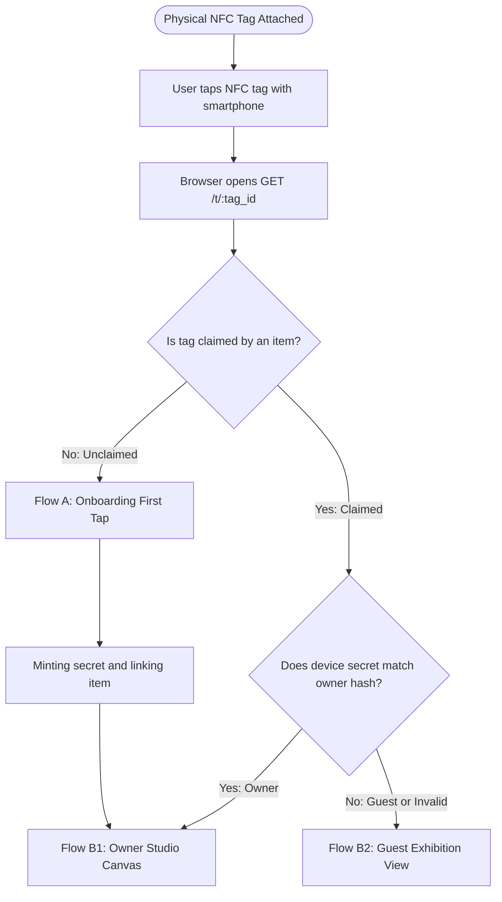
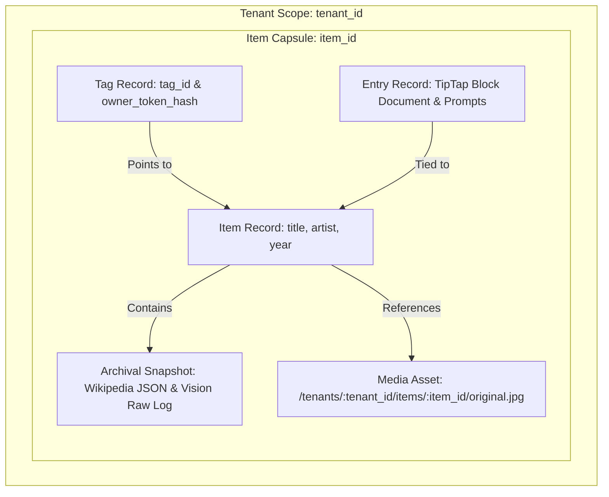
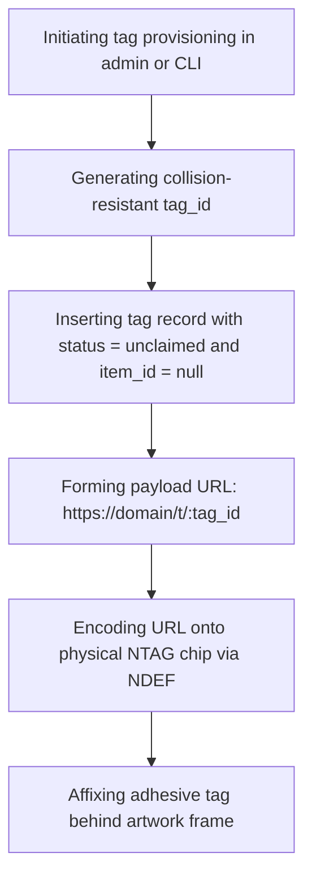
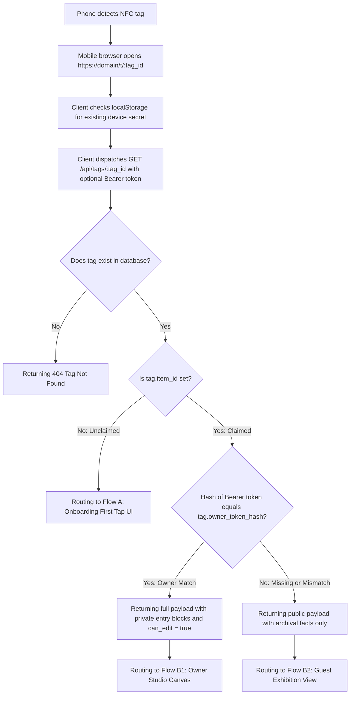
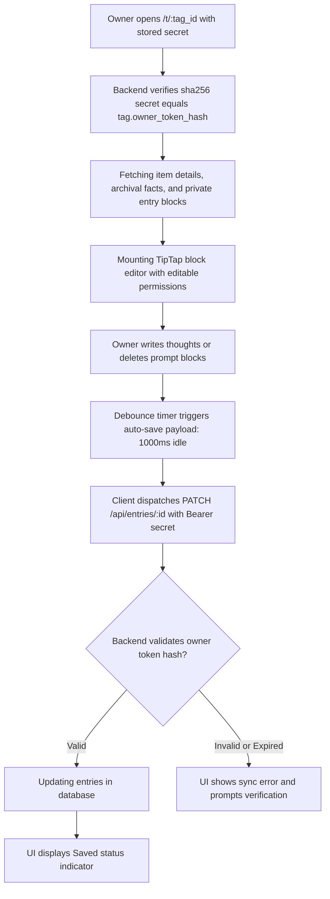
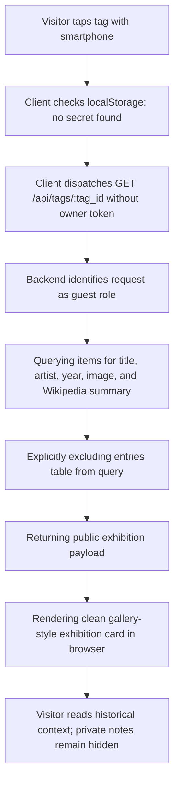
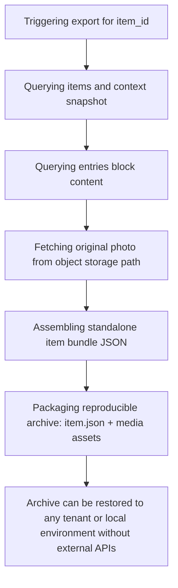

# System Processes and Lifecycle Specs

> Focus: Mapping process workflows, routing mechanics, data entities, and step-by-step flowchart models.

---

## Routing Lifecycle

---

## Encoding and Listening

### Uniqueness and ID Format
To remain lightweight, collision-resistant, and URL-friendly without leaking sequential business data:
- **Format**: 12 to 16-character URL-safe string (e.g., NanoID or Base62 UUID prefix).
- **Physical NFC Constraint**: NTAG213 chips have 144 bytes of storage. A compact URL keeps write payloads fast and minimizes NFC transfer latency.
  - *Example Tap URL*: `https://art.domain.com/t/xK9_2pL9q0` (less than 35 bytes).
- **Decoupling**: The physical tag does not store state or URLs with changing query parameters. It holds a single, permanent redirect handle.
- **Permanent Binding**: Once claimed by an item in Phase 1, the tag remains permanently linked to that item without reassigning or resetting.

### Listening and Routing Mechanism
The backend route acts as a lightweight dispatcher:
- **Endpoint**: `GET /t/:tag_id`
- **Responsibilities**:
  1. Parsing `:tag_id`.
  2. Performing a low-overhead lookup in the cache or database:
     - Checking existence and tenant association.
     - Checking whether an associated `item_id` exists.
  3. Dispatching response:
     - Directing HTTP 302 Redirect to the frontend client URL with a session or item token.
     - Or serving the lightweight single-page application shell directly, passing the initial tag state via hydration payload.

---

## Performance and Cost

1. **Routing with Edge Caching**:
   - The route handler `/t/:tag_id` executes in minimal memory with low latency (<50ms).
   - Inactive tags or cached reads can be served via an edge KV store or read-replica to prevent high database connection loads.

2. **Deferring External API Calls**:
   - External API calls (Google Cloud Vision, Wikipedia API, LLM prompt generation) execute only once during onboarding (Flow A).
   - Subsequent visits fetch persisted data directly from the database, preventing recurring cloud API billing and third-party rate limiting.

3. **Serving Stateless Frontend Payloads**:
   - The frontend bundle remains minimal; image recognition and external integrations run strictly on the backend API layer.

---

## Data Entities and Item Encapsulation

### Encapsulating Reproducible Item Bundles
Each piece of art is modeled as a self-contained, isolated item bundle under a tenant. This guarantees clean data separation, reproducible exports, and simple migration without data leakage:

### Tag Registry (`tags`)
- `id`: String (PK, NanoID or unique public handle)
- `tenant_id`: String (FK -> `tenants.id`, default Tenant 01)
- `status`: Enum (`unclaimed`, `registered`, `active`, `archived`)
- `item_id`: String (FK -> `items.id`, Nullable until first capture, permanent once set)
- `owner_token_hash`: String (Nullable, SHA-256 hash of device owner secret)
- `claimed_at`: Timestamp (Nullable)
- `created_at`: Timestamp

### Item and Context (`items`)
- `id`: String (PK, UUID or NanoID)
- `tenant_id`: String (FK)
- `title`: String (identified title or user override)
- `artist`: String (identified artist or unknown)
- `year`: String (optional)
- `image_url`: String (stored reference photo)
- `raw_recognition_data`: JSON (audit trail of vision API matches)
- `context`: JSON (Wikipedia summary, extract, source URLs)
- `created_at`: Timestamp
- `updated_at`: Timestamp

### Entry (`entries`)
- `id`: String (PK, UUID or NanoID)
- `item_id`: String (FK -> `items.id`)
- `tenant_id`: String (FK)
- `prompts`: JSON Array (disposable prompt strings generated during onboarding)
- `content`: JSON or Block Document (TipTap or block editor JSON representation)
- `created_at`: Timestamp
- `updated_at`: Timestamp

---

## Process Specifications

### Process 1: Provisioning Tags

Encoding and affixing new physical NFC tags before item pairing:

- **Method**: `provisionTag(tenantId: string) -> TagRecord`
- **Execution steps**:
  1. Generating collision-free ID `tag_id`.
  2. Creating record in `tags` table with `status = 'unclaimed'`, `item_id = null`.
  3. Returning payload URL: `https://<domain>/t/<tag_id>`.
  4. Writing URL to physical NFC chip via NFC Tools (or Web NFC interface).
  5. Affixing sticker to artwork frame.

---

### Process 2: Resolving Tag Taps

Listening for taps and routing devices based on ownership secrets:

- **Method**: `resolveTagTap(tagId: string, deviceSecret?: string) -> ResolutionResponse`
- **Execution steps**:
  1. Opening mobile browser to `https://<domain>/t/<tag_id>` via NDEF payload.
  2. Checking device `localStorage` for an existing `owner_token` tied to `:tag_id`.
  3. Sending hydration request: `GET /api/tags/:tag_id` with optional `Authorization: Bearer <device_secret>`.
  4. Verifying tag record in database:
     - **Branch 1 (First-Time or Unclaimed)**: `tags.item_id IS NULL`. Rendering Onboarding Screen (Flow A).
     - **Branch 2 (Claimed Owner)**: `tags.item_id IS NOT NULL` and `hash(device_secret) == tags.owner_token_hash`. Returning full item metadata, archival facts, private entry blocks, and `can_edit: true`.
     - **Branch 3 (Claimed Guest)**: `tags.item_id IS NOT NULL` and secret is missing or invalid. Returning public item facts only.

---

### Process 3: Onboarding First Tap (Flow A)

Capturing artwork, recognizing the painting, retrieving archival facts, handling fallback dialogs, generating prompts, and minting the device owner secret:

```mermaid
flowchart TD
    A1[Rendering camera trigger input] --> A2[User snaps photo of artwork]
    A2 --> A3[Uploading image blob to backend /api/identify]
    A3 --> A4[Saving image to object storage]
    A4 --> A5[Calling Google Cloud Vision WEB_DETECTION]
    A5 --> A6{Did Vision API recognize artwork?}
    
    A6 -->|No / Low confidence| APopup[Showing Pop-up: Artwork Not Recognized]
    APopup --> AChoice{User Selection}
    AChoice -->|Retake| A1
    AChoice -->|Continue| AManual[Entering title and artist manually or leaving unknown]
    
    A6 -->|Yes| AExtract[Extracting entity title, artist, Wikipedia URL]
    AExtract --> A7[Querying Wikipedia REST API /page/summary/:title]
    AManual --> A7
    
    A7 --> A8{Was Wikipedia entry found?}
    A8 -->|No| AWikiPopup[Showing Notice: No Wikipedia Summary Found]
    AWikiPopup --> AWikiContinue[User taps Continue]
    AWikiContinue --> AGenericPrompts[Generating generic reflective art journaling questions]
    
    A8 -->|Yes| AParseWiki[Parsing historical summary and details]
    AParseWiki --> AGroundPrompts[Prompting LLM with strict grounding on retrieved facts]
    
    AGroundPrompts --> APromptsReady[Introspective questions ready]
    AGenericPrompts --> APromptsReady
    
    APromptsReady --> AMint[Generating high-entropy raw_owner_secret]
    AMint --> AHash[Computing owner_token_hash = sha256 raw_owner_secret]
    AHash --> ACreateItem[Creating items record with archival snapshot]
    ACreateItem --> ACreateEntry[Creating initial entries record with prompt blocks]
    ACreateEntry --> ALockTag[Updating tags record: status = active, item_id, owner_token_hash]
    ALockTag --> ASendPayload[Returning raw_owner_secret and hydrated canvas payload to client]
    ASendPayload --> ASaveLocal[Client saving raw_owner_secret to localStorage]
    ASaveLocal --> AMountEditor[Mounting editable journaling canvas for owner]
```

- **Objective**: Pairing a physical painting to the tag, managing recognition fallbacks, retrieving facts, generating questions, and minting device ownership without passwords.
- **Execution steps**:
  1. `renderCapturePrompt()`: Presenting `<input type="file" accept="image/*" capture="environment">`.
  2. `submitArtworkImage(tagId, imageFile)`: Uploading photo to backend storage at `tenants/{tenant_id}/items/{item_id}/original.jpg`.
  3. `identifyArtwork(imageUri)`: Running Google Cloud Vision `WEB_DETECTION`.
     - If unrecognized: displaying pop-up modal offering "Retake Photo" or "Continue".
  4. `fetchFactualContext(entityMatch)`: Querying Wikipedia REST API.
     - If not found: displaying notice and allowing user to "Continue" with generic reflection questions.
  5. `generateWritingPrompts(archivalData)`: Prompting LLM for 2-3 introspective journaling questions.
  6. `completeTagRegistration(tagId, artData, prompts)`:
     - Generating 256-bit random string `raw_owner_secret`.
     - Computing `owner_token_hash = sha256(raw_owner_secret)`.
     - Inserting `items` record.
     - Inserting `entries` record pre-filled with prompts as removable blocks.
     - Updating `tags` record: permanently setting `item_id`, `owner_token_hash`, and marking `status = 'active'`.
     - Returning `{ item_id, raw_owner_secret, entry }` to frontend.
  7. `persistOwnerSecret(tagId, rawSecret)`: Storing `raw_owner_secret` in device `localStorage` and opening editor.

---

### Process 4: Viewing and Editing Owner Journal (Flow B1)

Loading full private canvas, typing thoughts, and syncing edits back to database via debounced auto-save:

- **Objective**: Displaying archival facts alongside private personal notes with debounced auto-saving.
- **Execution steps**:
  1. `fetchOwnerEntry(tagId, ownerSecret)`: Validating `sha256(ownerSecret) == tags.owner_token_hash` and retrieving full record.
  2. `mountOwnerCanvas(ownerPayload)`: Rendering archival banner with "Owner / Author" status and hydrating block editor.
  3. `autoSaveJournal(entryId, updatedBlocks, ownerSecret)`: Debouncing save requests and updating database.

---

### Process 5: Viewing Guest Exhibition (Flow B2)

Displaying read-only archival context for visitors:

- **Objective**: Presenting an exhibition card for visitors while keeping private personal notes completely inaccessible.
- **Execution steps**:
  1. `fetchGuestExhibition(tagId)`: Querying `items` for title, artist, year, and Wikipedia summary. Excluding `entries`.
  2. `mountGuestView(exhibitionPayload)`: Rendering gallery card without editor canvas or input fields.

---

### Process 6: Reproducing and Exporting Item Bundles

Isolating and serializing self-contained item capsules for backups, migrations, and reproductions:

- **Objective**: Ensuring every item exists as an independent, reproducible package that can be backed up or re-instantiated without calling external Vision or Wikipedia APIs.
- **Execution steps**:
  1. Exporting bundle: querying `items`, `entries`, and image asset.
  2. Packaging self-contained JSON with full immutable snapshot of Wikipedia context and original prompt history.
  3. Recreating or migrating: loading the bundle directly populates the database and storage without external dependencies.
